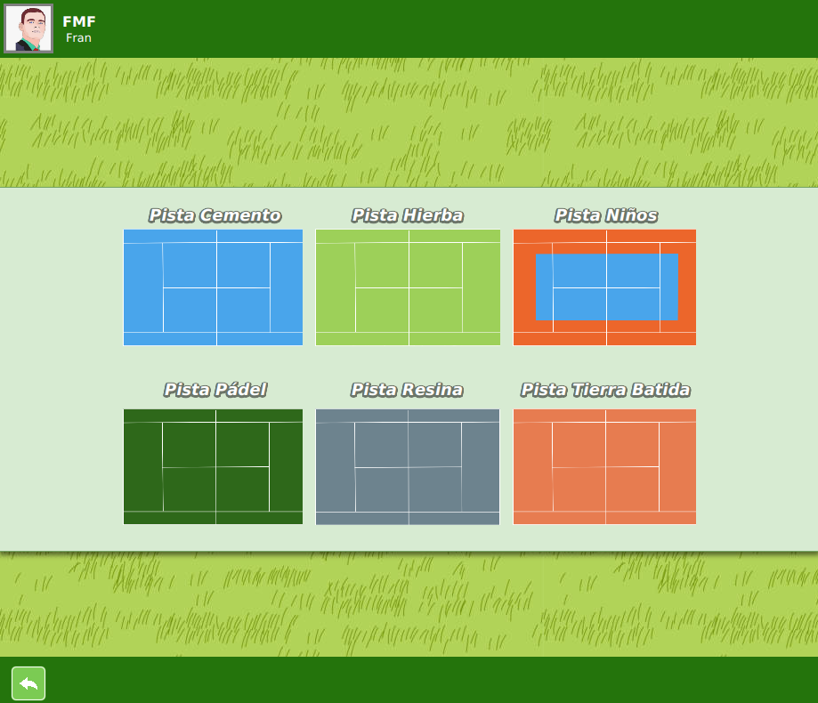

# IPC-TenisClubApplication

Aplicación para un polideportivo de tenis. Permite la reserva de pistas a tiempo real.

-Página de Inicio: vista previa de las reservas hechas para cada día y pista.

-Iniciar sesión.

-Registro usuario.

-Pagina Principal: reserva, maneja tus reservas y accede a tus datos.

-Reservar: elige la pista a reservar.

-Reservar Pista Específica: elige horario (si hay disponibilidad) para reservar la pista seleccionada. 

-Mis Reservas: visualiza las reservas realizadas, págala (simulación) o elimínala.

-Cambio Datos: cambia tus datos introducidos en el registro.

